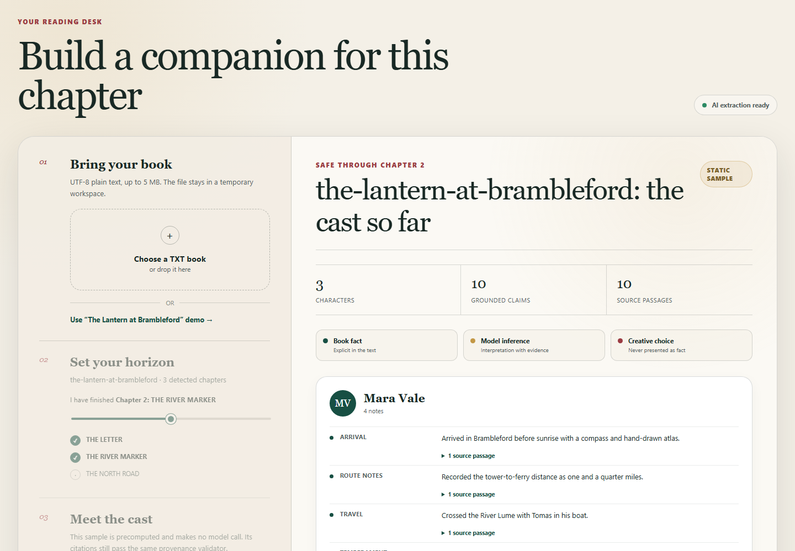

# Story Companion

[](https://github.com/dmitriygorlov/story-companion/actions/workflows/ci.yml)
[](https://www.python.org/downloads/release/python-3120/)
[](LICENSE)

**Read deeply. Stay unspoiled.**

Story Companion is an evidence-first AI reading companion. Give it a UTF-8 text
book, mark the last chapter you have finished, and get character notes built only
from the permitted part of the story. Every factual or interpretive claim carries
a source passage that the application validates against the book.

I started the project for my niece, who loves remembering who is who without
accidentally learning what happens next. I kept building it for myself: I am the
kind of reader who sketches routes in the margin and wonders how far the
characters travelled and how long the journey should have taken.


## What works today

- A responsive browser interface with no frontend build step
- UTF-8 `.txt` uploads up to 5 MB
- Deterministic detection of `Chapter ...`, `Prologue`, and `Epilogue` headings
- A reader-controlled, inclusive chapter boundary
- A spoiler-safe context object that physically excludes later chapters
- Provider-neutral character extraction with an optional OpenAI adapter
- Explicit `book_fact`, `model_inference`, and `creative_choice` categories
- Exact source excerpts with deterministic book, chapter, and offset validation
- An original three-chapter demo that works without an API key or paid call
- Interactive OpenAPI documentation at `/docs`



The bundled demo is intentionally small and original. It runs through the real
upload, chapter-detection, and boundary APIs, then displays a checked-in sample
result. The sample's citations are tested by the same provenance validator used
for provider output.

## Try the demo locally

Prerequisites: Python 3.12 and, optionally, `make`.

```bash
git clone https://github.com/dmitriygorlov/story-companion.git
cd story-companion
python -m venv .venv
source .venv/bin/activate
python -m pip install -e ".[dev]"
python -m uvicorn story_companion.main:app --reload
```

On Windows PowerShell, activate the environment with:

```powershell
.venv\Scripts\Activate.ps1
python -m pip install -e ".[dev]"
python -m uvicorn story_companion.main:app --reload
```

Open <http://localhost:8000> and choose **Preview the sample story**. No API key
is required for this path.

Convenience commands are also available:

```bash
make setup   # install the project and development tools
make run     # start the local application
make check   # lint, format-check, and test
```

## Use live character extraction

Create a project-scoped OpenAI API key, copy `.env.example` to `.env`, and set:

```dotenv
OPENAI_API_KEY=your_project_key_here
STORY_COMPANION_OPENAI_MODEL=gpt-5.6-luna
```

The model is configurable. Keys stay in the untracked `.env` file; the public
`/config` endpoint exposes only whether extraction is available. Automated tests
never make network calls.

The current adapter makes one structured extraction request and rejects contexts
over 200,000 characters instead of silently truncating them. Any returned claim
with missing, altered, ambiguous, out-of-range, or future-chapter evidence is
rejected before it reaches the reader.

## API workflow

The web interface uses the same small HTTP workflow available to other clients:

```text
POST /books
  -> detected chapter list and opaque book ID

PUT /books/{book_id}/spoiler-boundary
  -> inclusive last-readable chapter

GET /books/{book_id}/context
  -> text through that boundary only

POST /books/{book_id}/characters
  -> evidence-grounded character profiles
```

There is deliberately no endpoint that returns an uploaded book's unrestricted
full text. See the [architecture](docs/architecture.md) for the trust boundary and
the [product specification](docs/product-spec.md) for product behavior.

## Docker

```bash
docker compose up --build
```

Then open <http://localhost:8000>. Docker uses the same optional environment
variables from `.env.example`.

## Privacy, copyright, and current limits

- Upload only books you are entitled to process. This repository contains no
  third-party book text.
- Uploaded text is stored in a temporary local directory and removed on normal
  process shutdown. Book metadata and boundaries live in memory.
- A restart loses all uploaded books and results; multiple workers do not share
  state. This release is a local, single-user MVP, not a hosted multi-user service.
- Chapter detection is a transparent heuristic. The detected list is shown to the
  reader before a boundary is chosen.
- The OpenAI adapter sends only the spoiler-safe context to the configured model
  provider. The offline demo sends nothing externally.

## Roadmap

The next slices build on the same evidence contract:

1. Relationships and an event timeline with per-edge citations
2. Journey legs, stated distances, inferred travel time, and an uncertainty-aware map
3. Optional illustration briefs that keep creative decisions separate from canon
4. Durable storage, explicit deletion, authentication, and background processing

## Development

```bash
make lint
make test
# or run both
make check
```

CI runs Ruff and pytest on Python 3.12. The application is intentionally compact:
FastAPI and Pydantic on the backend, plain HTML/CSS/JavaScript in the browser, and
no database, Redis, queue, or frontend framework in this release.

## Project status

Version `0.2.0` is a complete local MVP for spoiler-safe character profiles. The
relationship, timeline, journey-map, and illustration stages remain roadmap items
and are not represented as finished features.
